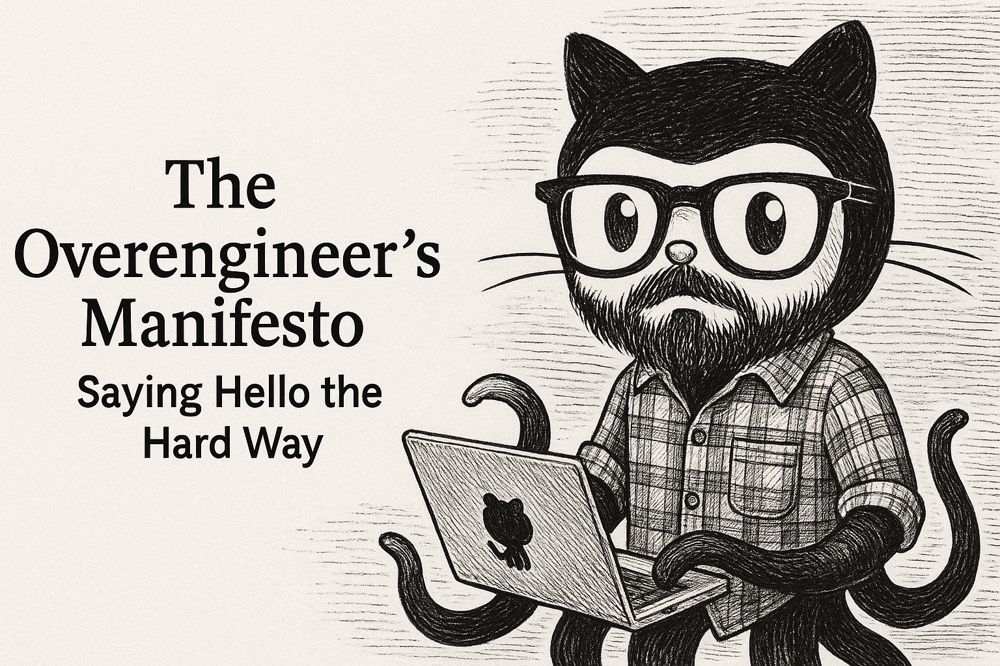

# The Overengineer’s Manifesto: Saying Hello the Hard Way

---

> **Project Complexity Score:** 1,417 lines of code & docs, 264 function/class/logic blocks—just to say "Hello".

---

> _This is the story of [OverHelloWorld](https://github.com/copyleftdev/OverHelloWorld): a project that started as a joke, but ended as a cautionary tale for developers everywhere._

## Introduction

Let’s face it: every developer, at some point, dreams of building a “Hello World” app so robust, so extensible, and so over-the-top that it could survive a nuclear apocalypse—or at least a code review from that one architect who thinks everything should be “cloud native.”

But what happens when you follow every best practice, leverage every framework, and refuse to stop until your greeting is observable, replayable, and deployable to Kubernetes? You get OverHelloWorld—a monument to the dangers (and joys) of overengineering.

---

## The Project: OverHelloWorld

What started as a simple “hello” became a monument to my ego and job security. Why stop at printing a string when you can have:

- **Domain-Driven Design (DDD):** Because “Hello” is a business domain, obviously.
- **CQRS & Event Sourcing:** Every greeting is a command, every response an immutable event. Want to know how many times I’ve said hello since 1997? I can replay the entire event log.
- **Redis Event Bus:** Because my “hello” needs to be scalable to millions of microservices.
- **Plugin System:** ASCII art? Text-to-speech? LED simulation? Yes, my “hello” can literally light up your life.
- **Prometheus & OpenTelemetry:** If you can’t monitor it, did you even say hello?
- **Property-Based Testing:** Because unit tests are for amateurs—let’s mathematically prove “hello” is correct for all possible strings.
- **Automated Test Reports:** Every test run deserves its own timestamped shrine.

---

## The Tests: Because Hello Should Never Fail

- **Unit Tests:** “Hello” is always spelled correctly.
- **Integration Tests:** POST a hello, GET a hello, repeat until you believe in CQRS.
- **Property-Based Tests:** For any string, in any language, at any time, “hello” will persist and replay. Even in Klingon.
- **Redis Edge Cases:** If Redis is down, you’ll know. If it’s up, your hello will echo across the cloud.
- **File Event Store:** Every “hello” is immortalized in `events.jsonl`—the Rosetta Stone of greetings.

Each test run generates a timestamped folder, complete with JSON logs and HTML coverage reports. Because future archaeologists will want to know how we said hello.

### When Complexity Bites Back: Cautionary Tales

- **The Pivot That Broke Everything:**
  Imagine a startup with a beautifully overengineered microservice architecture. One day, the business pivots: “We’re not saying ‘hello’ anymore, we’re saying ‘welcome!’” Suddenly, dozens of tightly coupled interfaces, event schemas, and metric labels need updating. Teams spend days tracing dependencies, rewriting tests, and fixing CI pipelines—while a competitor ships their pivot in an afternoon.

- **The Feature That Couldn’t Ship:**
  A product manager requests a new feature: custom greetings per user. What should be a simple config change turns into a saga—new domain models, event types, plugin interfaces, and migration scripts. The team spends more time updating documentation and tests than actually writing the feature, and the release slips by weeks.

- **The Onboarding Nightmare:**
  A new engineer joins and is handed the “hello” service. They spend days deciphering DDD aggregates, CQRS flows, and plugin contracts—just to add a log statement. Meanwhile, a simpler project onboards engineers in an hour.

- **The Debugging Time Sink:**
  A production bug appears: “hello” isn’t showing up in the UI. Instead of checking a single log, engineers must trace events across Redis, the file event store, and three plugins—each with its own logging format and observability stack. The root cause? A typo in a metric label.

> **Moral:** When you need to move fast, accidental complexity multiplies every change, slows every pivot, and turns small problems into all-hands-on-deck emergencies.

---

## The Byproducts of Overengineering

While poking fun at the extremes, sometimes you accidentally build:
- A robust, testable, observable microservice
- A CI/CD pipeline that runs more tests than the Linux kernel
- Documentation that rivals the length of War and Peace

### Serious Lessons from (Over)Engineering

- **Complexity is a tax:** Every layer, pattern, and tool adds cognitive load. This can slow down onboarding, development, and debugging—even if it’s fun at first.
- **Testing is a double-edged sword:** Property-based and integration tests catch real bugs, but can also make refactoring a nightmare if your abstractions aren’t stable.
- **Observability is invaluable:** Metrics, tracing, and logs make debugging easier and production safer. But if you need a dashboard to say “hello,” you might have gone too far.
- **Documentation is a legacy:** Overdocumenting can be a time sink, but future-you (or your replacement) will thank you. Just don’t let the docs outgrow the code.
- **Best practices are not one-size-fits-all:** Use them as guidelines, not gospel. Sometimes, a simple printf is all you need.
- **Overengineering is seductive:** It feels productive and impressive. But the best engineers know when to stop, simplify, and deliver value.

> **Bottom line:** Overengineering can be a fantastic learning experience, but it’s rarely the shortest path to a maintainable, successful product. The real skill is knowing when to stop architecting and start delivering.

---

## Plug: See the Madness for Yourself

Want to see how far the rabbit hole goes? [Check out the repo on GitHub!](https://github.com/copyleftdev/OverHelloWorld)

Star it, fork it, or use it as a warning for your team.

---

## Conclusion

OverHelloWorld is a monument to what’s possible when you let best practices, frameworks, and a dash of insecurity run wild. It’s fun, it’s impressive, and it’s a warning: just because you can doesn’t mean you should.

So next time you’re tempted to CQRS your “hello,” ask yourself: is this for the user, or for my résumé?

---

**Remember:**
Simplicity is a feature.  
Overengineering is a lifestyle choice—best enjoyed in moderation.

> "Simplicity is the ultimate sophistication." — Leonardo da Vinci
>
> In software, as in art, there is a balance between ego and elegance. Build boldly, but know when to let go.

---

> **Funny Note:** If you find this project well done, may God help you.
